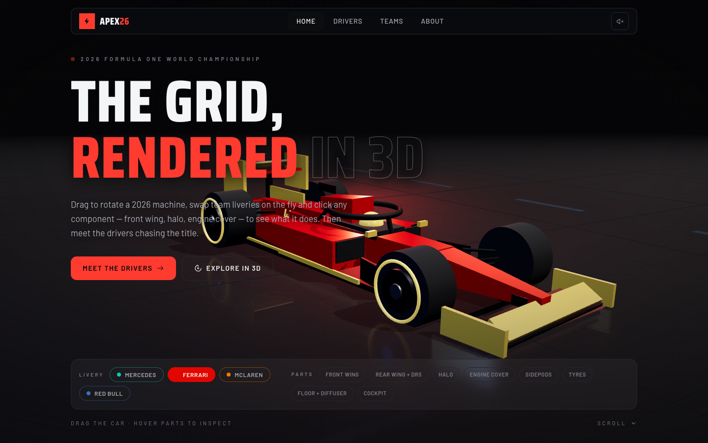
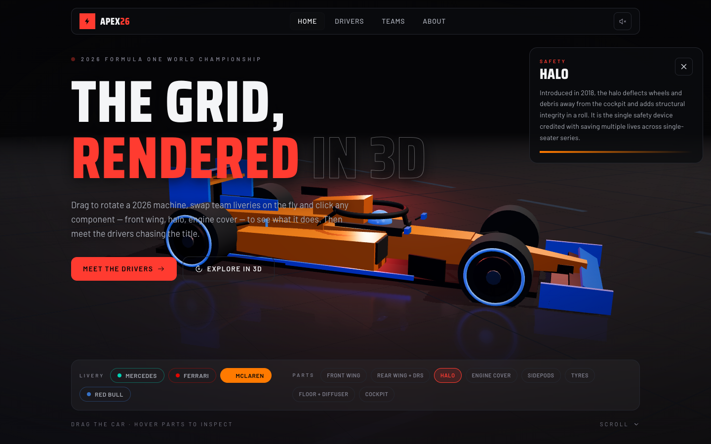
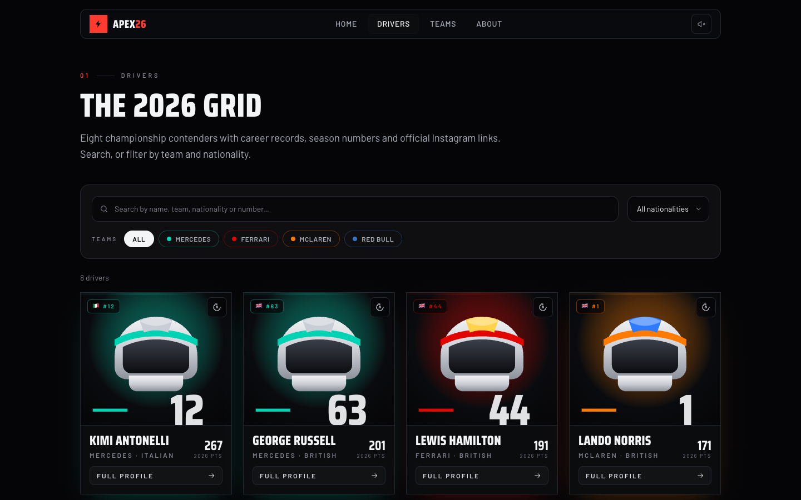
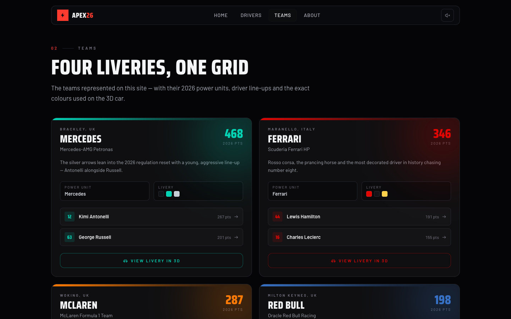
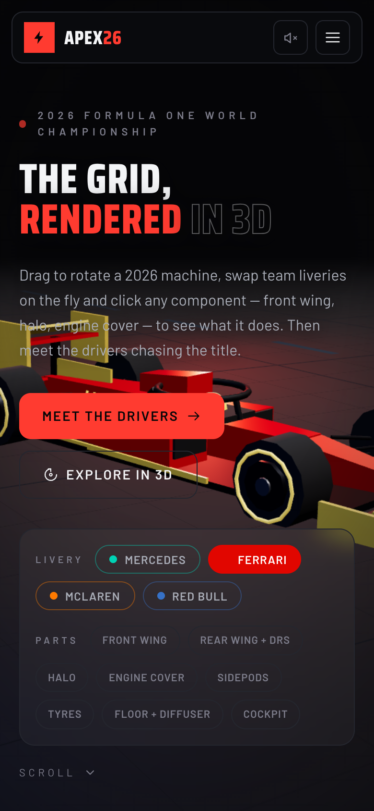

<p align="center">
  
</p>

# APEX 26 — the F1 grid, in 3D

A dark, high-contrast Formula 1 showcase built with React Three Fiber. A fully
interactive 3D car you can rotate, zoom and re-liveried live, a searchable
drivers grid with career + 2026 season stats, team pages that deep-link back
into the configurator, and a contact page — all wrapped in motorsport typography
and pit-garage motion.

## Screenshots

<table>
  <tr>
    <td width="50%"></td>
    <td width="50%"></td>
  </tr>
  <tr>
    <td></td>
    <td></td>
  </tr>
</table>

## Features

**3D car configurator (Home)**
- Drag to rotate, wheel/pinch to zoom, pointer parallax + scroll dolly camera rig
- Live livery switch across 4 teams (Mercedes, Ferrari, McLaren, Red Bull) with
  UI accents that recolor with the selected team
- Hoverable / clickable parts — front wing, rear wing + DRS, halo, engine cover,
  sidepods, tyres, floor + diffuser, cockpit — each with a tooltip and a detail panel
- Garage-floor stage with grid lighting, reflections and subtle idle motion
- Toggleable **Explore mode** (wheel zoom) so normal page scroll is never hijacked
- Optional GLB model via `VITE_CAR_MODEL_URL` env var; procedural car by default
- Engine-rev sound toggle

**Drivers**
- Grid → detail pages for all 8 drivers of the 2026 standings (as of the Italian GP)
- Search by name, filter by team or nationality
- Each profile: headshot placeholder, car number, nationality, clickable Instagram,
  career stats (championships / wins / poles / podiums / debut) and 2026 season stats
- Animated card flip between season and career views

**Teams & About**
- Team standings with livery colors, points and driver roster; selecting a team
  deep-links back to the Home configurator with that livery preselected
- About page with contact form (client-side validation, error → success states)

**Craft**
- Hash routing with animated page transitions and speed-streak wipes
- Self-hosted fonts: Saira Condensed (display) + Barlow (body)
- Desktop-first, fully responsive, mobile hamburger menu
- Reduced-motion support, WCAG-conscious contrast (accent text picks black/white
  from luminance), semantic headings, aria labels
- Lower-cost rendering on mobile; three.js lazy-loaded after first paint
- Lighthouse: **Performance 92 · Accessibility 100 · Best Practices 100 · SEO 100**

## Tech stack

| Layer      | Choice |
|------------|--------|
| Build      | Vite 8 · TypeScript 5.9 |
| UI         | React 19 · Tailwind CSS 4 |
| 3D         | three 0.182 · @react-three/fiber · @react-three/drei |
| Motion     | Framer Motion |
| Routing    | Lightweight hash router (no react-router) |
| E2E        | puppeteer-core + system Chrome |

## Getting started

```sh
npm install
npm run dev        # http://127.0.0.1:5173
```

```sh
npm run build      # typecheck + production build → dist/
npm run preview    # serve dist/ on http://127.0.0.1:4174
npm run typecheck  # tsc -b only
```

Optional: point the configurator at a real GLB instead of the procedural car:

```sh
VITE_CAR_MODEL_URL=/models/car.glb npm run dev
```

## End-to-end verification

A puppeteer suite drives the built site through desktop (1440×900), mobile
(390×844, touch) and reduced-motion runs: console cleanliness, canvas sizing,
routing, livery/parts UI, search + filters, card flip, contact-form validation
and the mobile menu — 29 checks in total, with screenshots written to
`verification/`.

```sh
npm run preview &                      # serve dist/ on :4174
npm run verify                         # or: node scripts/verify.mjs <baseUrl>
```

Requires Google Chrome at the standard macOS path
(`/Applications/Google Chrome.app/...`) — see `CHROME` in
[`scripts/verify.mjs`](scripts/verify.mjs) to adjust.

## Project structure

```
src/
  components/
    three/        # CarStage (canvas, lights, rig, interactions) + F1Car (procedural geometry)
    ui/           # nav, headings, shared bits
  pages/          # Home, Drivers, DriverDetail, Teams, About
  data/           # drivers.ts (standings, stats, bios) — edit content here
  lib/            # utils (cx, clamp, damp, onColor contrast helper)
scripts/
  verify.mjs      # e2e suite
docs/             # README screenshots
```

All content — drivers, standings, teams, liveries, part descriptions — lives in
`src/data/` and can be edited without touching components.
